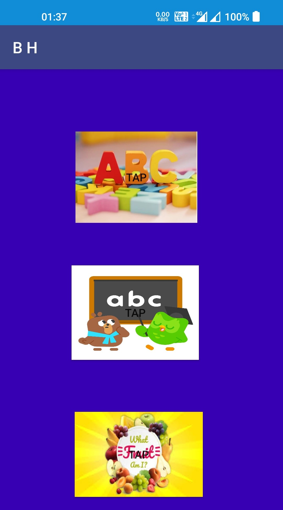
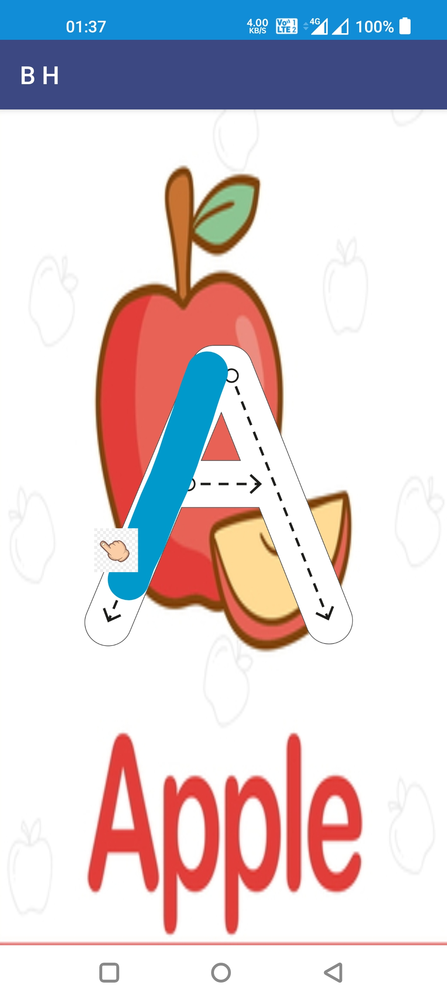
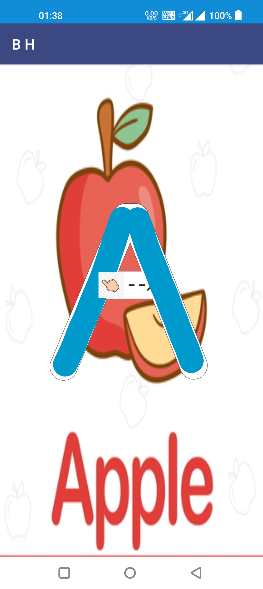
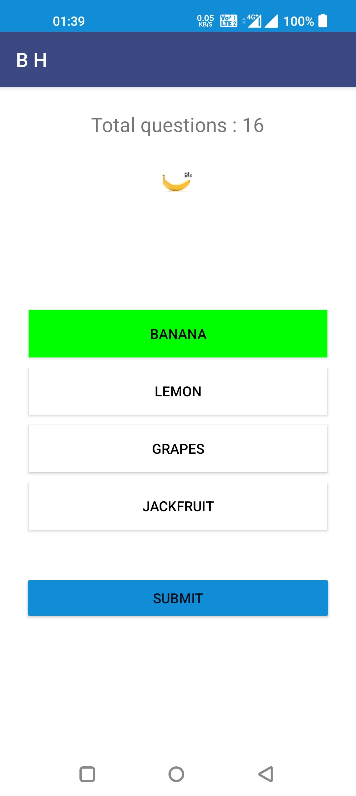
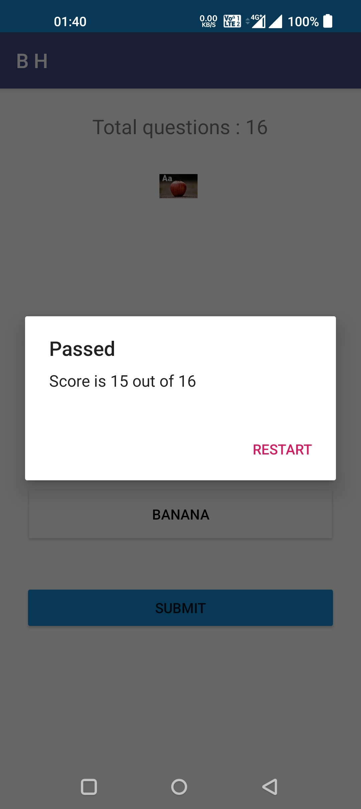

# Bhasha Hastalikith 📱✏️

**Bhasha Hastalikith** is an Android app developed to help children learn to trace Latin alphabets and Indo-Arabic numerals. The app provides an interactive and engaging learning experience, offering users tools to practice writing letters and numbers. Built with Java using Android Studio, the app features smooth touch interactions, a user-friendly interface, and fun voice-based feedback that reinforces learning. 🎧🖋️

## Features 🌟:
- **Alphabet Tracing:** Allows children to trace both uppercase and lowercase Latin alphabets (A-Z, a-z) 🅰️🅱️.
- **Number Tracing:** Provides practice for Indo-Arabic numerals (0-9) 🔢.
- **Interactive Learning:** Smooth touch interactions make tracing fun and easy 👆.
- **User-friendly Interface:** Simple and intuitive design, accessible for young learners 🧸.
- **Voice Feedback:** Voice recordings activate once a character is traced. For example, when tracing the letter "D," the voice will say "D for Dog" with a picture of a dog 🐕🔠.
- **Quiz Section:** After completing the tracing exercises, children can take a quiz to test their knowledge and reinforce what they've learned 📝.

## Screenshots 📸
1. **Homepage:**
   
   
2. **Character Card:**
   
   
3. **Modal View:**
   
   
4. **Search Results:**
   

## Tech Stack 🖥️
- **Programming Language:** Java 🖊️
- **Development Environment:** Android Studio 🧑‍💻
- **Layout:** XML for user interface design 📐
- **Library:** Custom views for interactive tracing 📚

## How it Works ⚙️:
- The app provides a visual and interactive interface where children can trace characters using their fingers ✋.
- The app detects the user’s movements and provides real-time feedback 🧠💡.
- Instructions and feedback are displayed to guide children throughout the tracing process 👶.
- Each letter and number has a corresponding voice recording that activates once the tracing is complete 🎙️. For example, "D for Dog" when tracing the letter "D."
- A quiz section allows children to test their knowledge and improve retention of the characters they have learned 🎮.

## How to Use 📝
1. **Launch the App:** Open the Bhasha Hastalikith app on your Android device 📲.
   
2. **Select a Character:** Choose a letter or number to trace from the main menu 📜.
     
3. **Trace the Character:** Use your finger to trace the character on the screen ✏️. You will see visual guides to help with the tracing 👀.
   
4. **Voice Feedback:** Once you complete tracing, the app will play the corresponding voice (e.g., "D for Dog" for the letter "D") 🎤.
5. **Complete the Quiz:** After practicing several characters, take the quiz to test your knowledge and reinforce what you’ve learned 🏅.
     
6. **Repeat:** Go through the process again with new characters to continue improving your tracing skills 🔄.
   

## App Benefits 🌱
- **Improved Handwriting Skills:** By practicing the tracing of letters and numbers, children can improve their fine motor skills and hand-eye coordination 🤲.
- **Reinforced Learning:** The combination of visual, auditory, and tactile feedback strengthens memory retention and reinforces the connection between letters/numbers and associated words or objects 🧠💡.
- **Engagement and Fun:** The app includes colorful visuals and fun voiceovers to keep children engaged, making learning a more enjoyable process 🎨🎶.
- **Self-paced Learning:** Children can learn at their own pace without feeling pressured, allowing for better learning outcomes ⏳.
- **Quiz Integration:** The built-in quiz encourages children to recall what they’ve learned, reinforcing the alphabet and numbers in a playful, interactive way 🎉.

## Conclusion 🏁
The **Bhasha Hastalikith** app is an educational tool for children to learn and practice tracing both Latin alphabets and Indo-Arabic numerals. By offering an engaging and interactive experience with voice feedback and quizzes, the app helps children develop fine motor skills, reinforce letter-word associations, and improve their handwriting in a fun, intuitive way 🏆.
